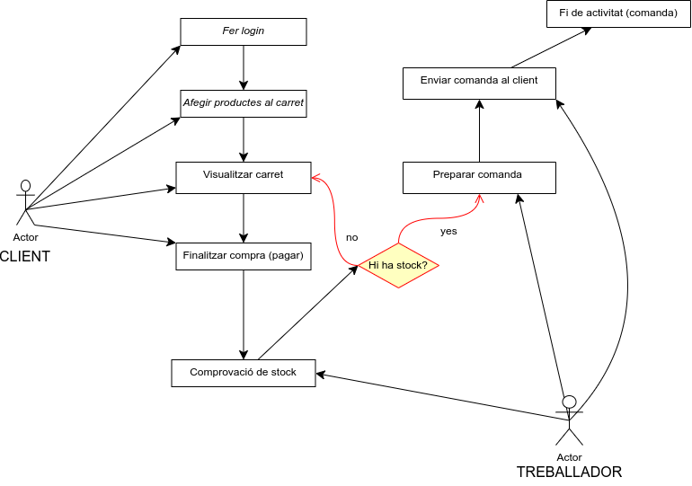

# **TechHRJ**

## **Identificació del Tema**
El projecte *TechHRJ* es basa en el desenvolupament d'un sistema de gestió de vendes de components per a ordinadors. El sistema permetrà gestionar els components (com processadors, targetes gràfiques, memòria RAM, etc.), les comandes de clients i els inventaris.

## **Descripció del Sistema**
El sistema es compon de diversos mòduls per gestionar les operacions de la botiga de components d'ordinador, incloent-hi:
- Gestió de productes (components d'ordinadors)
- Gestió de comandes
- Gestió d'inventari
- Gestió de clients

## **Classes Necessàries**

### **1. Classe: Producte**
- **Descripció**: Representa un component d'ordinador en el sistema.
- **Atributs**:
    - `nom` (String): Nom del component.
    - `marca` (String): Marca del component.
    - `preu` (Decimal): Preu del component.
    - `stock` (Enter): Quantitat disponible en inventari de cada component.
- **Mètodes**:
    - `mostrarInformacio`: Mostra informació de cada component.

### **2. Classe: Client**
- **Descripció**: Representa un client que realitza comandes iniciant sessió anteriorment.
- **Atributs**:
    - `nom` (String): Nom del client.
    - `correu_electronic` (String): Correu electrònic del client.
    - `dni` (String): Dni del client.
    - `telf` (Int): Telèfon del client.
- **Mètodes**:

### **3. Classe: Comanda**
- **Descripció**: Comandes fetes per clients.
- **Atributs**:
    - `client` (Client): Client que ha realitzat la comanda.
    - `data` (Date): Data de la comanda.
    - `total` (Decimal): Import total de la comanda.
    - `estat` (String): Estat de la comanda (ex. "En procés", "Enviada").
- **Mètodes**:
    - `calcular_total()`: Calcula el total de la comanda sumant els preus dels productes.

### **4. Classe: Inventari**
- **Descripció**: Gestiona l'estoc de components d'ordinador.
- **Atributs**:
    - `llista_productes` (List[Producte]): Llista de tots els productes en stock.
- **Mètodes**:
    - `afegir_producte(producte: Producte)`: Afegeix un producte a l'inventari.
    - `consultar_estoc()`: Mostra l'estoc disponible de tots els productes.
    - `actualitzar_stock(producte: Producte, quantitat: int)`: Actualitza l'estoc d'un producte específic.

## **Diagrama de Classes**
A continuació es mostra el diagrama de classes del sistema:

## **Diagrama de Casos d'Ús**
El següent diagrama mostra els casos d'ús principals per a aquest sistema:

## **Diagrama d'activitats**
El següent diagrama mostra l'activitat alhora de fer una comanda

*Autors de TechHRJ*
- Hugo
- Roberto
- Jordi